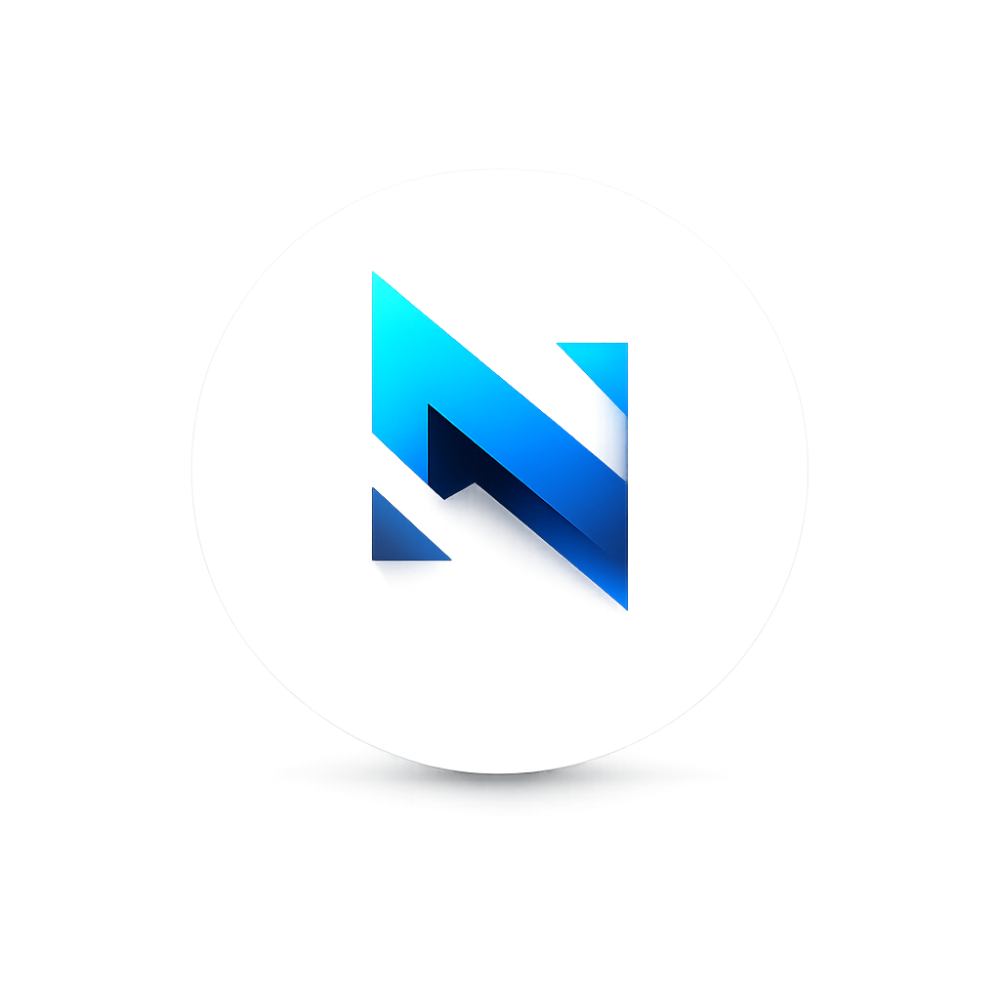

<p align="center">

</p>
<h1 align="center">Nokhal</h1>

<p align="center">
  Simple • Fast • Secure
</p>

⚡ A fast, simple and secure embedded key-value database for Go.
No setup. No dependencies. Just store and retrieve data.

**Nokhal** is an embedded database for Go focused on **API simplicity** and **robust internal architecture**.
No SQL, no complex setup — just a single `.nok` file that is secure, fast, and easy to use.

---

# 📊 Project Stats

| Metric | Value |
|--------|-------|
| 🧾 Lines of Code | **2498** |
| 📂 Files (.go) | **12** |
| 🔤 Extensions | `.go` |
| 📅 Last Scan | 2026-03-01 |

---

## 🚀 Features

* ⚡ **High performance** with append-only (WAL) writes
* 🔒 **AES-256-GCM encryption** by default
* 🧠 **In-memory index** for fast reads
* 🔄 **Safe concurrency** (multi-goroutine)
* 💾 **Efficient binary storage** (no JSON)
* 🧩 **Simple, idiomatic Go API**
* 🛡️ **Crash-safe design** (no data corruption)
* 📦 **Single file storage (.nok)**

---

## Why Nokhal?

- ⚡ Extremely simple API
- 🔒 Built-in encryption
- 📦 Single file database
- 🚀 High performance

## 📦 Installation

```bash
go get github.com/wesleyyan-sb/nokhal
```

---

## ⚡ Quick Start

```go
package main

import (
    "log"
    "github.com/wesleyyan-sb/nokhal"
)

func main() {
    db, err := nokhal.Open("data.nok", "password")
    if err != nil { log.Fatal(err) }
    defer db.Close()

    db.Put("users", "id", []byte("Yan"))

    val, _ := db.Get("users", "id")
    println(string(val))
}
```

---

## 🧠 Concept

Nokhal is designed to be:

* As simple as using a `map`
* As safe as a real database
* As lightweight as a local file

It takes conceptual inspiration from SQLite, BoltDB, and BadgerDB — but with a strong focus on developer experience.

---

## 🔐 Security

* AES-256 in GCM mode
* Unique nonce per record
* Secure key derivation (Argon2 / PBKDF2)
* Transparent encryption at rest

> No custom cryptography is used.

---

## 🏗️ Architecture

* 📁 `.nok` file format
* 🧾 Append-only log (WAL)
* 🔁 Periodic compaction
* 📊 In-memory index rebuilt at startup
* ✅ Per-record checksum

---

## ⚙️ API

```go
db.Put(key, value)
db.Get(key, &value)
db.Delete(key)
db.Query(fn)
```

No SQL. No ORM. No overhead.

---

## 📈 Performance

Nokhal is designed for:

* Low latency
* Fast writes (append-only)
* Minimal memory allocations

### 📊 Benchmarks

| Operation     | Nokhal | SQLite | PostgreSQL | MySQL | MongoDB | Redis  |
| ------------- | ------ | ------ | ---------- | ----- | ------- | ------ |
| Insert        | 0.1ms  | 0.8ms  | 1.4ms      | 1.2ms | 1.0ms   | 0.15ms |
| Read (Single) | 0.1ms  | 0.5ms  | 0.9ms      | 0.8ms | 0.6ms   | 0.08ms |
| Update        | 0.2ms | 0.9ms  | 1.5ms      | 1.3ms | 1.1ms   | 0.18ms |
| Delete        | 0.1ms | 0.7ms  | 1.2ms      | 1.0ms | 0.9ms   | 0.14ms |


#### 📌 Comparison with KV Stores

| Operation    | Nokhal | LevelDB | RocksDB |
| ------------ | ------ | ------- | ------- |
| Insert       | 0.1ms  | 0.3ms   | 0.25ms  |
| Read         | 0.1ms  | 0.15ms  | 0.12ms  |
| Batch Insert | 5ms    | 4ms     | 3.5ms   |

---

## 🛣️ Roadmap

* [X] Persistent indexing
* [X] TTL (expiration)
* [X] Snapshots
* [X] Backup / Restore
* [X] Full multi-process support

---

## 🤝 Contributing

Pull requests are welcome.
If you want to help build something simple, fast, and reliable — you're welcome here.

---

## 📜 License

Apache 2.0

---

## ✨ Philosophy

> Simple on the surface. Powerful underneath.
